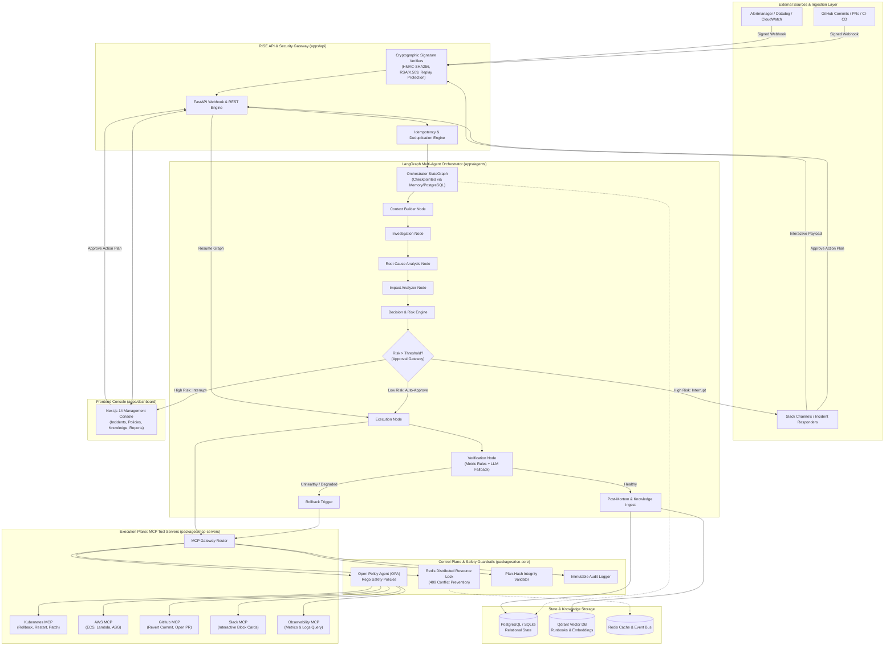
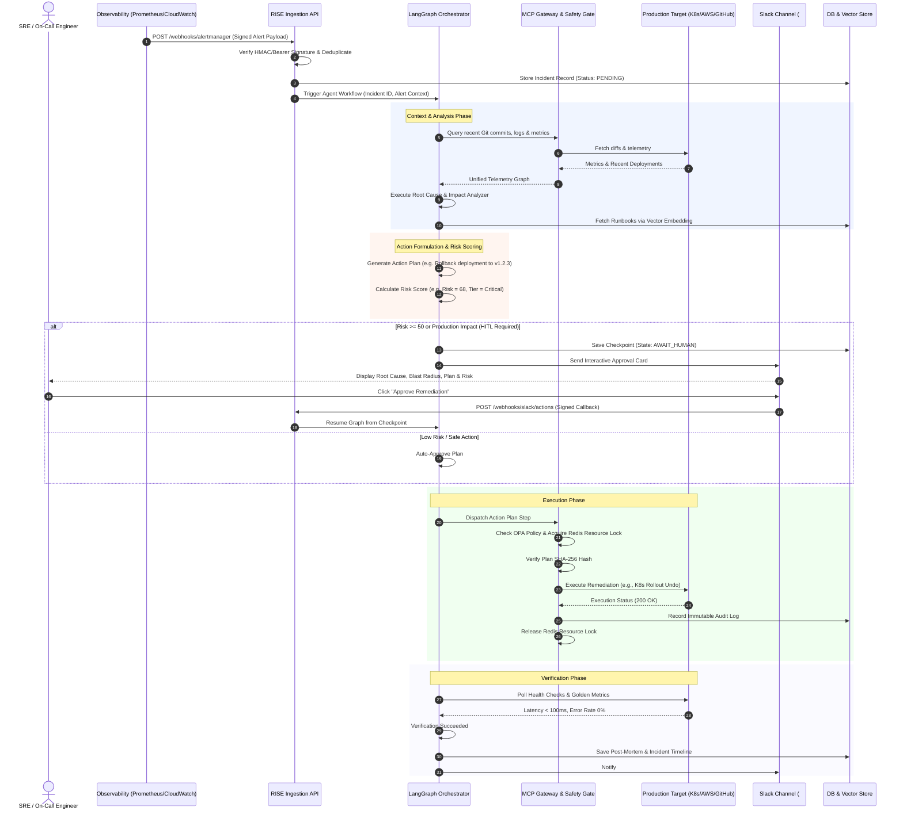

# RISE (Reliability & Incident Self-Healing Engine)
## Architecture, Data Flow, Implementation Status & Operational Audit

---

## 1. Executive Summary

**RISE** is an enterprise-grade, autonomous incident remediation and self-healing engine. It ingests alerts and change events from observability platforms (Prometheus, Alertmanager, Datadog, AWS CloudWatch), reconstructs incident context across git repositories and telemetry, performs automated root-cause analysis (RCA) and blast-radius impact analysis via LangGraph multi-agent orchestration, synthesizes safety-verified action plans, and executes remediations via isolated Model Context Protocol (MCP) servers under Open Policy Agent (OPA) guardrails and human-in-the-loop (HITL) approval.

---

## 2. Implementation Status: What is Working vs. What is Pending

### ✅ 2.1 Fully Implemented & Verified Working

1. **Multi-Agent Orchestrator Graph (`apps/agents/src/orchestrator/graph.py`)**:
   - Built on **LangGraph** `StateGraph` with state checkpointing (`MemorySaver` / `PostgresSaver`).
   - Durable pause/resume mechanics across process restarts via `interrupt_after=["await_human"]`.
   - Node progression: **Context Builder** $\to$ **Investigation** $\to$ **Root Cause** $\to$ **Impact Analyzer** $\to$ **Decision / Action Planner** $\to$ **Approval Gate (HITL)** $\to$ **Execution** $\to$ **Verification** $\to$ **Post-Mortem / Rollback**.

2. **Multi-Agent Nodes & Decision Engines (`apps/agents/src/nodes/` & `engines/`)**:
   - **Context Builder**: Correlates alerts, Git commits, PR diffs, Slack threads, and CMDB service topologies.
   - **Investigation Node**: Queries logs and metrics via MCP observability tools.
   - **Root Cause Engine**: Hypothesis formulation against recent deployments, code changes, and infrastructure anomalies.
   - **Impact Analyzer**: Computes blast radius, affected downstream services, tenant tiers, and SLO breaches.
   - **Action Planner & Risk Engine**: Generates targeted remediation steps (Kubernetes pod restart, deployment rollback, config patch, autoscaling, GitHub PR revert), calculating risk score (0–100) and confidence score (0–1.0).
   - **Verification Node**: Hybrid rule-based health/metric evaluation with LLM fallback verdict. Automatically triggers rollback upon verification failure.

3. **Security & Guardrail Middleware (`packages/rise-core/mcp_client/`)**:
   - **OPA Policy Gate**: Real-time evaluation against OPA Rego policies (`policies/guardrails/rego/safety.rego`) before any MCP tool execution. Blocks unapproved tools and unsafe arguments.
   - **Resource Concurrency Lock Manager (`lock.py`)**: Distributed Redis locking with in-memory fallback to prevent race conditions or simultaneous mutating actions on the same infrastructure resource (returns HTTP 409 `RESOURCE_LOCKED`).
   - **Plan-Hash Integrity Check**: SHA-256 hash validation before execution to ensure no tampered steps execute without re-authorization (returns HTTP 409 `ACTION_PLAN_CHANGED`).
   - **Immutable Audit Logging**: Every tool dispatch records input parameters, user ID, tenant ID, and approval metadata.

4. **Webhook Ingestion & Cryptographic Verifiers (`apps/api/src/routers/webhooks.py`)**:
   - **GitHub Webhooks**: HMAC-SHA256 signature verification (`X-Hub-Signature-256`).
   - **Alertmanager / Prometheus**: Shared-secret bearer header verification.
   - **AWS CloudWatch / SNS**: Cryptographic X.509 certificate signature verification.
   - **Slack Interactive Callbacks**: HMAC-SHA256 signature + timestamp replay protection.
   - **Idempotency**: Message deduplication and payload normalization into unified incident models.

5. **REST API Backend (`apps/api/src/`)**:
   - Complete FastAPI application with endpoints for Incidents, Timeline, Action Plans, Approvals, Rollbacks, Policies, Knowledge Base, Reports/Post-mortems, and Health/Readiness probes.
   - OpenAPI 3.1 specification compliance (`apps/api/openapi.yaml`).

6. **Dashboard UI (`apps/dashboard/`)**:
   - **Next.js 14** (App Router), Tailwind CSS, Lucide icons, Recharts, and Radix UI components.
   - **Incidents Console** (`/incidents`): Real-time list, severity filtering, status badges, MTTR stats.
   - **Incident Workspace** (`/incidents/[id]`): Multi-agent timeline, RCA breakdown, impact matrix, action plan execution steps, live execution logs, and manual approval/rollback controls.
   - **Knowledge Base** (`/knowledge`): Runbook library, vector embeddings, similarity lookups.
   - **Policies Console** (`/policies`): OPA rule management, risk threshold sliders, auto-remediation toggles.
   - **Integrations Console** (`/integrations`): Service health, MCP server statuses, webhook URLs.
   - **Reports Console** (`/reports`): Post-mortem generator, SLA trends, false-positive metrics.

7. **MCP Server Tool Ecosystem (`packages/mcp-servers/`)**:
   - **Kubernetes MCP**: Pod restarts, deployment rollbacks, scale replicas, configmap updates.
   - **GitHub MCP**: Revert commits, open emergency PRs, fetch file diffs, post review comments.
   - **AWS MCP**: ECS service updates, Lambda function rollbacks, AutoScaling group adjustments.
   - **Slack MCP**: Post interactive incident cards, update block messages, manage approval channels.
   - **Observability MCP**: Query Prometheus/Datadog metrics, fetch CloudWatch/Loki logs.
   - **Knowledge MCP**: Ingest runbooks, retrieve semantic embeddings from vector database.

8. **Comprehensive Testing & Evaluation Suite**:
   - **560+ automated tests** covering unit, integration, chaos resilience, security injection, and schema compliance.
   - **Phase 5 Eval Suite (`eval/run_eval.py`)**: 20 Golden Ground-Truth Incidents (100% RCA accuracy) and 10 Adversarial Injection Scenarios (0 false auto-approvals).

---

### ⚠️ 2.2 What Requires Live Production Credentials / Infrastructure (Mock vs. Live)

The codebase is built with dual-mode support: **Mock/Emulated Mode (Local/Test)** and **Live Production Mode (Target Infrastructure)**.

| Feature / Subsystem | Local / Test State (Working) | Production State Requirement |
| :--- | :--- | :--- |
| **Database Persistence** | SQLite (`rise_dev.db`) / In-Memory with full Alembic migration models. | Requires live PostgreSQL connection (`DATABASE_URL`) with Supabase / RDS. |
| **Distributed Locking & Caching** | Local in-memory lock fallback (`MemoryLockManager`). | Requires live Redis instance (`REDIS_URL`). |
| **Vector Search & Embeddings** | In-memory similarity & mock Qdrant client. | Requires live Qdrant cluster (`QDRANT_URL`, `QDRANT_API_KEY`) & OpenAI/Vertex embedding model. |
| **LLM Inference** | Mock deterministic responses / local Ollama / Groq / Anthropic / OpenAI / Gemini API keys. | Requires production LLM API keys (`GROQ_API_KEY`, `GEMINI_API_KEY`, `OPENAI_API_KEY`, or `ANTHROPIC_API_KEY`). |
| **Kubernetes MCP** | Local Kubernetes mock responses & simulated cluster failure recovery. | Requires live `KUBECONFIG` / in-cluster ServiceAccount token with RBAC permissions. |
| **Slack Interactive Approval** | Simulated webhook loop and mock block-kit card payloads. | Requires registered Slack App with `SLACK_BOT_TOKEN` and `SLACK_SIGNING_SECRET`. |
| **GitHub Automated PR / Reverts** | Simulated GitHub REST/GraphQL responses. | Requires installed GitHub App / Personal Access Token (`GITHUB_TOKEN`, `GITHUB_APP_ID`). |
| **CloudWatch / AWS Remediations** | Mock Boto3 client & SNS validation harness. | Requires AWS IAM credentials (`AWS_ACCESS_KEY_ID`, `AWS_SECRET_ACCESS_KEY`, `AWS_REGION`). |

---

### ❌ 2.3 What is NOT Working / Known Operational Limitations

1. **Live Multi-Cloud Kubernetes Cluster Execution**: In an unconfigured environment, attempting live pod restart or deployment rollout against a physical k8s cluster fails unless valid cluster credentials are supplied in `.env`.
2. **Real Slack End-to-End Interactivity Without Public Tunnel**: Slack cannot dispatch interactive button webhooks to `localhost:8000` without an ingress controller or tunnel (e.g., ngrok/Cloudflare Tunnel).
3. **Automated Continuous Learning Loop from Human Edits**: While post-mortems are generated and saved to the knowledge store, online automated reinforcement weight updating for risk scoring based on manual engineer overrides is currently a planned post-v1 feature.

---

## 3. High-Level System Architecture Diagram



---

## 4. End-to-End Data Flow & Incident Lifecycle



---

## 5. Component Breakdown & Directory Map

```
c:\Project\RISE\
├── apps\
│   ├── agents\                  # LangGraph Multi-Agent Engine
│   │   └── src\
│   │       ├── orchestrator\    # StateGraph definition & durable checkpointing
│   │       ├── nodes\           # ContextBuilder, Investigation, RCA, Impact, Execution, Verification
│   │       ├── engines\         # ActionPlanner, DecisionEngine, RiskEngine, PatchValidator
│   │       └── services\        # Telemetry, CMDB, Runbook resolver
│   ├── api\                     # FastAPI Ingestion & Control API
│   │   └── src\
│   │       ├── routers\         # webhooks, incidents, actions, policies, knowledge, reports
│   │       ├── deps\            # Cryptographic signature auth, DB sessions, rate limiting
│   │       └── middleware\      # OPA enforcement, correlation IDs, error handlers
│   └── dashboard\               # Next.js 14 Web Frontend
│       ├── app\                 # Incidents, Policies, Knowledge, Integrations, Reports, Login
│       ├── components\          # UI cards, Timeline, Diff viewer, Metric charts, Action triggers
│       └── lib\                 # API client, TypeScript definitions, state hooks
├── packages\
│   ├── rise-core\               # Shared Platform Kernel
│   │   ├── mcp_client\          # MCP Gateway, OPA evaluation, Redis lock manager
│   │   ├── knowledge_service\   # Qdrant/Chroma vector embeddings & semantic search
│   │   ├── llm_gateway\         # Multi-provider LLM abstraction (Groq, Claude, GPT-4, Gemini, Bedrock, Ollama)
│   │   ├── topology\            # Dependency graph & blast-radius mapper
│   │   ├── schemas\             # Pydantic schemas (Incidents, Actions, Alerts, Telemetry)
│   │   └── db\                  # SQLAlchemy ORM models, session providers, Alembic migrations
│   └── mcp-servers\             # Isolated Tool Execution Daemons
│       ├── mcp-kubernetes\      # Pod restart, deployment rollback, scaling, configmap patch
│       ├── mcp-github\          # Git diff fetch, PR creation, commit rollback
│       ├── mcp-aws\             # ECS update, Lambda rollback, ASG scaling
│       ├── mcp-slack\           # Block-kit interactive messaging & channel alerts
│       └── mcp-observability\   # Prometheus, Datadog, CloudWatch query tools
├── policies\                    # Open Policy Agent (OPA) Guardrails
│   └── guardrails\rego\         # Rego rules (Allowed tools, risk thresholds, protected targets)
├── eval\                        # Reliability & Adversarial Evaluation Suite
│   ├── golden_dataset\          # 20 ground-truth production incidents
│   ├── adversarial_dataset\     # 10 prompt injection & unsafe action attack scenarios
│   └── run_eval.py              # Automated evaluation runner & certification harness
└── infra\                       # Deployment Configurations
    ├── docker-compose.yml       # Local full-stack runtime (Postgres, Redis, Qdrant, API, Dashboard)
    └── k8s\                     # Helm / Kubernetes deployment manifests
```

---

## 6. Security, Governance & Safety Guardrails

| Guardrail Layer | Implementation Mechanism | Enforced Behavior |
| :--- | :--- | :--- |
| **Ingress Cryptography** | HMAC-SHA256 / RSA-X509 | Rejects unauthorized webhook payloads with HTTP 401. |
| **OPA Policy Enforcement** | Open Policy Agent (Rego) | Blocks blacklisted commands (e.g. `rm -rf`, `DROP DATABASE`, unapproved cluster namespaces). |
| **Resource Concurrency Locking** | Redis distributed mutex with TTL | Prevents concurrent agent executions from colliding on the same pod/service (HTTP 409). |
| **Action Plan Hash Integrity** | SHA-256 Hash Matching | Rejects execution if an action plan payload was modified between approval and execution (HTTP 409). |
| **Human-in-the-Loop (HITL)** | LangGraph Checkpoint Interrupt | Mandates human approval via Slack/Dashboard for any action with Risk Score $\ge 50$ or touching production. |
| **Automated Rollback** | Verification Engine with SLA thresholding | Immediately reverts changes if post-execution health metrics or error rates fail SLA. |
| **Audit Compliance** | Append-only Audit Trail | Records every actor, decision, parameter, and timestamp for SOC2/ISO27001 auditing. |
